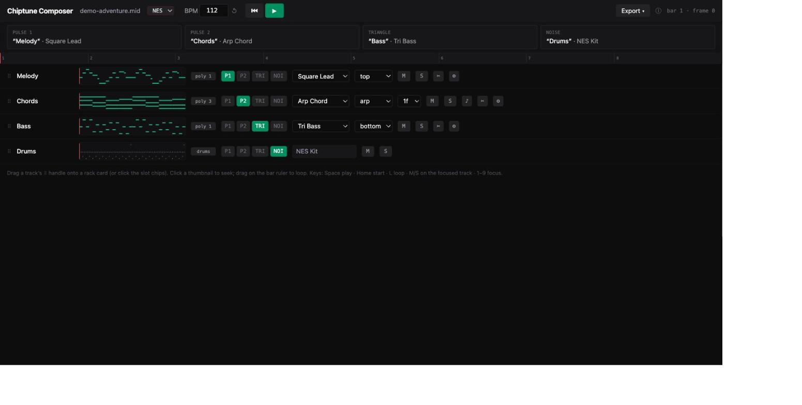

# Chiptune Composer

Turn any MIDI file into music that sounds like it came out of an NES or a Game Boy — in your
browser, in seconds, with no login and no server.



Drop in a `.mid`, and the auto-arranger assigns your tracks to real chip channels: melodies to the
pulse channels, bass to the triangle (or the Game Boy's wavetable), drums to the noise LFSR. Chords
become fast arpeggios — the way NES composers actually did it — and everything is compiled to a
frame-by-frame register script played by an authentic sound model in an AudioWorklet.

**Try it:** https://app-drab-six-81.vercel.app

## Features

- **Two chips**: NES 2A03 (nonlinear mixer, console output filter, authentic timer-quantized
  detune) and Game Boy DMG (four wavetable presets, 64 Hz envelope quantization, true stereo with
  per-channel hard pan). Switch mid-playback.
- **Polyphony done the 8-bit way**: top/bottom note extraction, compiler-generated arpeggios with
  chord-tone reduction, split-across-channels mode, and pulse-layer modes (double, detune, echo,
  octave).
- **A real GM drum map** onto the noise channel: kick, snare, three tom tiers, hats, crash, ride,
  metal hit — priority-resolved like the originals.
- **FamiTracker-style instruments**: per-frame volume/duty/pitch/arpeggio macros, plus quick
  tweaks (duty, attack/decay, vibrato) without a macro editor.
- **Regions**: split a track at any bar and give bars 17–32 a different instrument, channel, or
  poly mode.
- **Chord Assist**: detects your key and chords, enriches triads with diatonic 7ths/9ths/sus, and
  offers substitute progressions from the
  [free-midi-chords](https://github.com/ldrolez/free-midi-chords) corpus, voiced for the chip.
- **Export & share**: 16-bit WAV (44.1/48 kHz, optional loop 2× + fade, sample-identical to
  playback), self-contained project JSON, arranged MIDI (arps written out as fast notes), and
  share links that pack the whole project into the URL.

## Development

```
npm install
npm run dev        # local dev server
npm test           # vitest (engine, compiler, theory — 214 tests)
npm run build      # production build (dist/)
npm run lint
```

Developer-only scripts:

```
node scripts/make-demo-midis.mjs                          # regenerate the demo songs
python3 scripts/build_chord_library.py path/to/free-midi-chords   # rebuild the chord library
```

The spec (`SPEC.md`) is the source of truth for the architecture; `CLAUDE.md` holds the working
conventions. The audio engine lives in `src/audio/apu-worklet.ts` (shared by realtime playback,
offline WAV rendering, and the Node test suite), the pure compiler in `src/engine/compile.ts`.

To enable the "Buy me a coffee" link, set `COFFEE_URL` in `src/config.ts`.

## Credits

- Chord progressions derived from [ldrolez/free-midi-chords](https://github.com/ldrolez/free-midi-chords) (MIT)
- NES APU documentation: [NESdev wiki](https://www.nesdev.org/wiki/APU)
- Game Boy audio documentation: [Pan Docs](https://gbdev.io/pandocs/Audio.html)

Not affiliated with Nintendo. No Nintendo assets are used or imitated.

## License

[MIT](LICENSE) © 2026 Shane Morris
